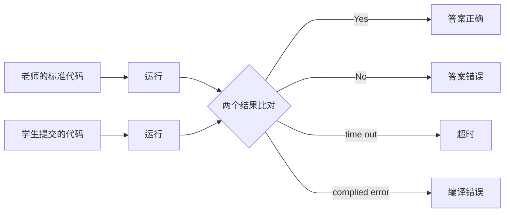

## 简介

`SQLOJ` 顾名思义, 就是一个可以对 `SQL` 语言进行在线评判的系统, 市面上的 `oj` 数量很多, 但是 `SQL` 类的比较少, 因为 `SQL` 一般只被用来处理数据库内容, 所以不及别的语言应用范围广, 但是数据库作为计算机系统中非常重要的组成部分, 有一个面向学习的 OJ 还是非常又有必要的。

## 设计思路

由于 `SQL` 语言的特殊性, 所以我们的题目并不是独立的, 而需要依赖于特定的数据库与测试数据集. 一道题目由三个方面决定
1. 数据库: 不同的数据库有自己的 "方言" .
2. 测试数据集: 一般来说数据库题目都是对一个数据库或表等进行操作, 要有一个操作对象, 数据集就是题目的操作对象, 对于建表等题目, 可以简单的看作是对空表操作, 或者对数据库系统表操作.
3. 题目: 题目描述

对于判题流程，简图如下：

### 判题

一般来说 OJ 的判题都是黑盒测试，也就是说，将提交者代码的运行结果与标准答案的结果进行比对，从而判断答案是否正确。这样有一个好处，就是可以发挥答题者的自由，写出不同样式的答案，只要运行结果符合就算答案正确，当然代码的时间与空间复杂度不能太高，所以也会限制代码运行的时间与所需空间。 

`OJ` 最重要的是实现它的判题功能, 但是由于本项目的特殊性, 我们对题目也进行了一些限制, 确保能够进行判题: 

>1. 答案必须存在, 也就是说答案必须是一个输出( 空表也算输出 )，但不能是无返回的( `INSERT`, `UPDATE`, `CREAT TABLE` 等操作语句 ); 所有我们需要将这些无返回值的全部转化成有返回值的操作, 比如我们可以用 `INSERT` 语句输出操作后的各种表开进行判断.
>2. 可以实现多表判断, 但是对于事务等一次执行完成的代码, 则只会判断最后的输出. 

#### 判题实现

由于现在的数据库种类很多，我们教学一般还是关系数据库，其中比较著名的是 `mysql` , `Mariadb` 和 `SQL Server`，所以本项目主要是要实现对这三种常用数据库的判题实现，虽然各个数据库的主要语法是一样的，但是各自还拥有独特的“方言”，所以在判题的时候要进行区分。
	基础的判题思路是，我们给定一个数据库，对这个数据库进行操作，然后我们通过数据库的
